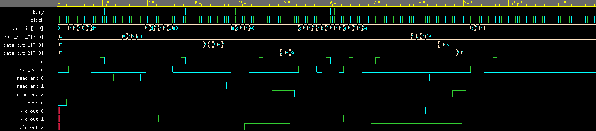

ROUTER 1X3 IN VERILOG

INTRODUCTION
The goal of this project is to build a 1x3 Router in Verilog HDL. This router takes packets as input from a single input port and sends them to one of three different output ports based on their destination address.


FUNCTIONALITY
There are a number of features that the router has:

- 1 input port and 3 output ports
- Data is transferred in packets
- Each output port has an associated first-in/first-out (FIFO) buffer.
- Each packet contains a parity bit (bit for error detection).
- Error detection takes place using the parity bits in the packets.
- Synchronization is used throughout.


STRUCTURE 
The router is comprised of several components:

- Control Unit
    - The Control Unit uses a finite-state machine (FSM) for routing packets and controlling output ports.

- FIFO
    - There is a FIFO buffer for each output port of the router.

- Register
    - The router has registers for each packet's data, in addition to its parity bit.

- Synchronizer
    - The synchronizer is responsible for generating read/write enable signals for the router.

- Top-level Module
    - The top-level module integrates all of the router's modules.


File Structure 
The project will have these folders: 
Router1x3

── rtl/
       control.v
       fifo.v
       register.v
       sync.v
       top.v

── tb/
      router_tb.sv

── sim/
      Makefile


SIMULATION 
Verilogs ability to account for 1x3 routers can be verified through QuestaSim Software! 

The following lines will help you simulate the design: 
```bash
vlib work
vlog rtl/*.v tb/router_tb.sv
vsim router_top_tb
add wave -r /*
run -all
```

- All valid packets will be sent through correctly
- FIFO buffers will store and manage empty/full conditions of Fifo
- All invalid packets will have an asserted error signal



TB FUNCTIONALITY
Creates more than just one packet; will create thousands of packets
Tests all 3 output ports
Ensures results on all FIFO full and empty
Ensures that no packets with incorrect parity will pass through as valid packets


