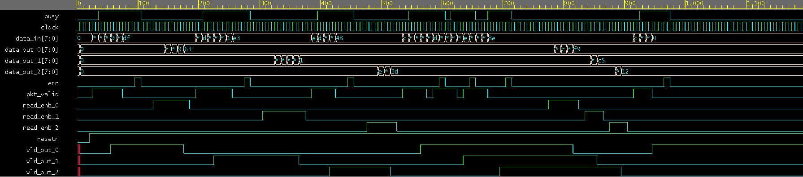

<div align="center">

#  Router 1×3 in Verilog HDL

### **High-Speed Packet Router with FIFO Buffering & Parity Error Detection**

[]()
[]()
[]()
[]()
[]()
[]()

*A synthesizable **1×3 Packet Router** implemented in Verilog HDL with FIFO buffering, parity error detection, synchronization logic, and comprehensive verification.*

</div>

---

# 📖 Overview

The **Router 1×3** is a digital communication router designed using **Verilog HDL**.

The router accepts packets from a **single input port** and forwards each packet to **one of three output ports** according to its destination address.

The design includes:

- 🚀 High-speed packet routing
- 📦 FIFO-based buffering
- 🛡 Parity error detection
- 🔄 Synchronization logic
- 🎛 FSM-based controller
- ✅ Comprehensive SystemVerilog testbench

---

# ✨ Features

- 📥 **1 Input Port**
- 📤 **3 Output Ports**
- 📦 Packet-Based Data Transfer
- 🧮 FSM-Based Routing Controller
- 🗂 Independent FIFO Buffer for each Output Port
- 🛡 Parity-Based Error Detection
- 🔄 Read/Write Synchronization
- ⚡ Fully Synthesizable RTL
- ✅ SystemVerilog Verification Environment

---

# 🧩 Router Architecture

```text
                  +--------------------+
                  |     Input Port     |
                  +---------+----------+
                            |
                            v
                  +--------------------+
                  |     Register       |
                  +---------+----------+
                            |
                            v
                  +--------------------+
                  |   Control Unit     |
                  |      (FSM)         |
                  +----+----+----+-----+
                       |    |    |
          +------------+    |    +------------+
          |                 |                 |
          v                 v                 v
     +---------+      +---------+      +---------+
     | FIFO 0  |      | FIFO 1  |      | FIFO 2  |
     +----+----+      +----+----+      +----+----+
          |                 |                 |
          v                 v                 v
      Output 0          Output 1          Output 2
```

---

# 🏗 Project Components

### 🎛 Control Unit

- Finite State Machine (FSM)
- Controls packet flow
- Generates routing decisions
- Controls FIFO read/write operations

---

### 📦 FIFO Buffers

Each output port has its own FIFO.

Features:

- Independent buffering
- Full detection
- Empty detection
- Ordered packet delivery

---

### 📝 Register Module

Stores

- Packet Header
- Payload Data
- Parity Bit

Acts as an interface between the input port and the routing logic.

---

### 🔄 Synchronizer

Responsible for

- Read Enable generation
- Write Enable generation
- FIFO synchronization
- Safe packet transfer

---

### 🔗 Top Module

Integrates

- Control Unit
- FIFOs
- Registers
- Synchronizer

into a complete **1×3 Router**.

---

# 📂 Project Structure

```text
Router1x3
│
├── rtl/
│   ├── control.v        ← FSM Controller
│   ├── fifo.v           ← FIFO Buffer
│   ├── register.v       ← Packet Register
│   ├── sync.v           ← Synchronizer
│   └── top.v            ← Top-Level Router
│
├── tb/
│   └── router_tb.sv     ← SystemVerilog Testbench
│
└── sim/
    └── Makefile
```

---

# 🛠 Prerequisites

| Tool | Version |
|-------|----------|
| QuestaSim | Recommended |
| GNU Make | Optional |

The project is fully synthesizable and compatible with standard Verilog simulators.

---

# ▶ Running Simulation

Compile the project

```bash
vlib work

vlog rtl/*.v tb/router_tb.sv
```

Launch simulation

```bash
vsim router_top_tb
```

View all signals

```tcl
add wave -r /*
```

Run simulation

```tcl
run -all
```

---

# ✅ Expected Results

Successful simulation demonstrates:

- ✅ Correct packet routing
- ✅ Destination-based packet forwarding
- ✅ FIFO buffering
- ✅ FIFO Full detection
- ✅ FIFO Empty detection
- ✅ Correct parity verification
- ✅ Invalid packet rejection
- ✅ Proper synchronization


---

# 📊 Packet Flow

```text
Incoming Packet
        │
        ▼
 Packet Register
        │
        ▼
 Control FSM
        │
        ▼
Destination Decode
        │
 ┌──────┼──────┐
 ▼      ▼      ▼
FIFO0 FIFO1 FIFO2
 │      │      │
 ▼      ▼      ▼
OUT0   OUT1   OUT2
```

---

# 🛡 Error Detection

Each packet contains a **Parity Bit**.

The router performs parity verification before forwarding packets.

### Valid Packet

```text
Calculated Parity == Received Parity
```

✔ Packet Accepted

---

### Invalid Packet

```text
Calculated Parity ≠ Received Parity
```

❌ Error Signal Asserted

Packet is discarded as invalid.

---

# 🧪 Testbench Features

The verification environment performs extensive testing.

### ✔ Packet Generation

- Generates thousands of packets
- Randomized packet transmission
- Multiple destination addresses

### ✔ Functional Verification

- Tests all three output ports
- Verifies packet ordering
- Checks routing correctness

### ✔ FIFO Verification

- FIFO Full condition
- FIFO Empty condition
- Read/Write synchronization
- Overflow protection

### ✔ Error Verification

- Valid parity packets
- Invalid parity packets
- Error signal assertion
- Packet rejection

---

# 🎯 Design Highlights

✨ Fully Synthesizable Verilog RTL

🚀 FSM-Based Router Controller

📦 Three Independent FIFO Buffers

🛡 Built-in Parity Error Detection

🔄 Synchronization Logic

⚡ Efficient Packet Routing

🧪 Comprehensive SystemVerilog Testbench

📊 Extensive Functional Verification

---

# 📝 Applications

This router architecture is suitable for

- 📡 Network-on-Chip (NoC)
- 💻 Embedded Communication Systems
- 🔄 FPGA-Based Packet Switching
- 🌐 Digital Communication Networks
- 🛰 High-Speed Data Routing
- 🎓 Digital Design & VLSI Learning Projects

---

<div align="center">

## ⭐ Router 1×3

**Verilog HDL Packet Router with FIFO Buffering & Error Detection**

Designed using **Verilog HDL** • Verified with **SystemVerilog** • Simulated using **QuestaSim**

</div>
